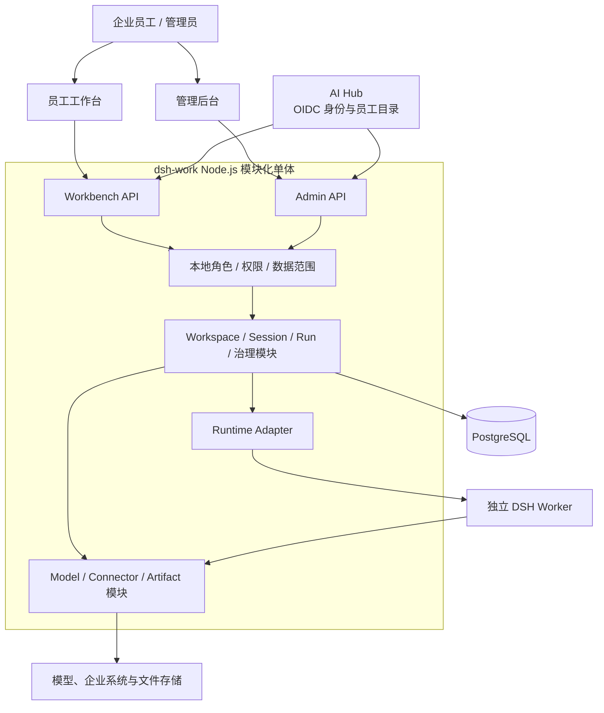

# dsh-work

> 面向企业员工的 AI Agent 工作台，基于 DeepSeek Harness（DSH），统一承载企业知识查询、只读业务工具、文件分析、成果交付与运行治理。

## 项目背景

企业知识、业务数据和文件通常分散在知识库、ERP、MES 及员工本地工作环境中。员工需要在多个系统之间查询、整理和重复加工数据，通用 AI 工具又不能在缺少身份、权限、审计和数据边界的情况下直接访问企业资源。

dsh-work 为这些能力提供统一的企业级入口：员工以自然语言发起任务，平台在服务端识别身份和权限，调用经过治理的知识、只读业务工具与文件处理能力，并交付可追溯的回答、分析结果和文件成果。

## 产品定位

dsh-work 是面向企业员工的统一 AI Agent 工作台，同时提供独立的管理后台。员工工作台负责对话、工作空间、文件和成果体验；管理后台负责 Agent、Skill、Tool、Runtime、权限、用量与审计治理。

平台负责身份、业务对象、权限、运行编排和审计事实。DSH 作为可替换的执行内核，只处理单次 Attempt 内的模型与 Tool 调用编排，不承担产品数据库、企业身份或长期业务凭据管理。

## 核心功能

- 统一对话入口：通过自然语言发起企业知识查询、业务查询和文件分析任务；
- 个人与团队工作空间：组织对话、文件、成果和协作上下文，并执行成员权限控制；
- 文件与成果：上传和分析常见办公文件，保存来源、版本和下载权限；
- Agent 与能力治理：管理 Agent、Skill、预置 Tool/Connector 和模型路由的版本与可用范围；
- 运行与调度：以 Session、Run、Attempt 和 Runtime Manifest 组织可取消、可重试、可追踪的执行链路；
- 企业身份与权限：使用 AI Hub 统一登录并同步员工资料，在应用内配置角色、功能权限和业务数据范围；
- 审计与运营：记录运行、模型、Tool、成果和管理操作，提供用量、健康与异常追踪。

## 产品边界

- 企业系统接入以只读、类型化 Tool 为默认方式，不允许 DSH 直接连接 ERP/MES 数据库；
- 员工不能直接访问 DSH、任意 Shell、任意 SQL 或长期业务凭据；
- Tool、Connector 和模型能力由平台统一治理，不由员工绕过平台自行安装；
- 产品 Session、Run、文件、成果和权限事实由 dsh-work 持有，不依赖 DSH 内部对象；
- 逻辑模块用于划分职责和依赖，不默认拆分为业务微服务。

## 设计原则

- 一个入口：员工通过统一工作台使用企业 AI 能力；
- 服务端可信：身份、权限和操作人均由服务端建立，不能由浏览器声明；
- 版本不可变：已发布能力和运行快照可追溯，重试不会覆盖历史 Attempt；
- 最小权限：企业能力默认只读，Tool 使用 Allowlist，敏感数据按范围过滤；
- Runtime 可替换：业务对象只依赖稳定的 Runtime Adapter 和标准 Run Event；
- 默认可审计：运行和治理操作保留结构化、脱敏的审计事实。

## 架构概览



两个 Vue 应用独立构建并使用两个 API Audience；服务端长期保持模块化单体。每个 Attempt 默认使用独立 DSH Worker 子进程，模块边界不等同于微服务边界。完整设计见 [产品与系统架构总览](docs/architecture/overview.md)。

## 仓库结构

```text
apps/
├── workbench-web          # 员工工作台（Vue 3）
└── admin-web              # 管理后台（Vue 3 + Element Plus）
packages/                  # Design Token 与共享无状态组件
server/                    # Node.js / TypeScript 模块化单体
├── migrations/            # PostgreSQL 显式迁移
└── src/modules/           # 领域、应用与适配器模块
docs/                      # 架构、契约、部署、测试和项目记录
scripts/                   # 架构检查、里程碑验证与 DSH 探针
e2e/                       # Playwright 浏览器冒烟
```

## 文档

- [文档导航与维护规则](docs/README.md)
- [产品与系统架构总览](docs/architecture/overview.md)
- [数据模型](docs/data-model.md)
- [内部端口契约](docs/contracts/internal-ports.md)

项目状态、实施路线、部署、测试和验收记录统一收录在 `docs/`，不在 README 中重复维护。
