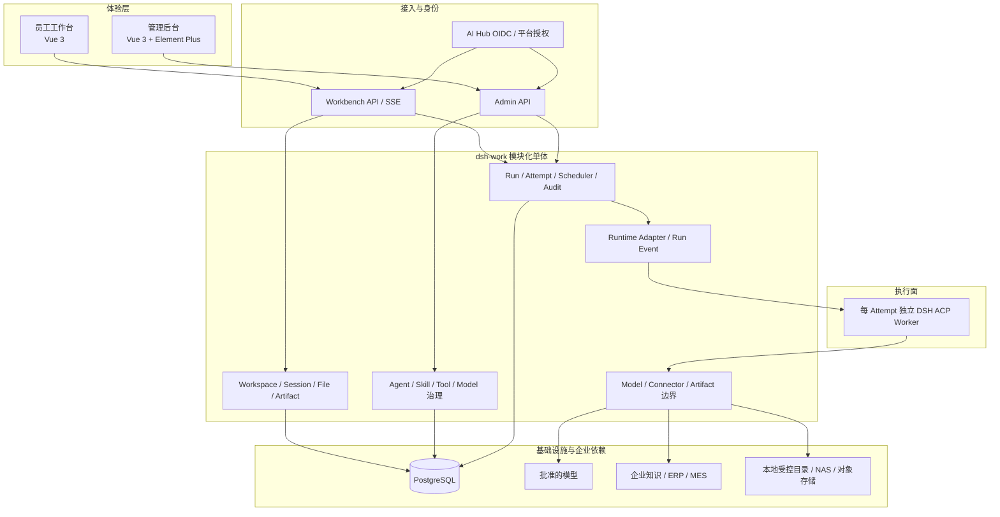
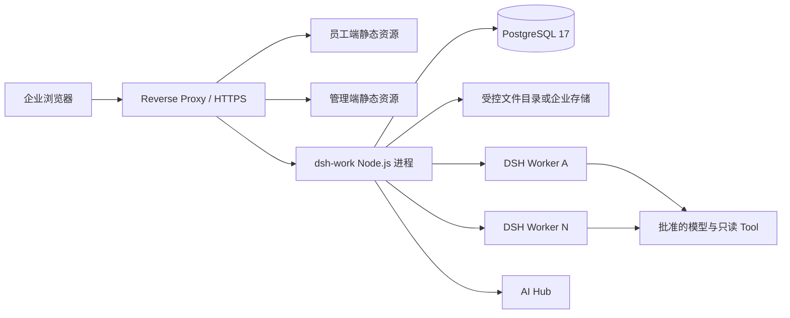

# dsh-work 产品与系统架构总览

**文档状态：** 当前架构基线 
**更新日期：** 2026-09-01 
**当前阶段：** MVP 试点准备 
**技术形态：** 两个独立 Vue 应用 + 一个 Node.js 模块化单体 + PostgreSQL + 独立 DSH Worker 进程 
**身份来源：** AI Hub OIDC（生产/联调）或受控原型身份（本地演示）

本文统一描述 dsh-work 的产品范围、系统边界和长期架构。接口字段、物理表和里程碑证据不在本文重复维护，分别以 `docs/contracts/`、`server/migrations/` 和 `docs/project/` 为准。

## 1. 产品定位与范围

dsh-work 是部署在企业内网的统一 AI Agent 工作台。员工通过自然语言使用经过授权的企业知识、业务数据和文件处理能力，获得带来源的回答、分析结论和可下载成果；平台管理员通过独立管理后台维护 Agent、Skill、预置 Tool/Connector、Runtime、权限、用量和审计。

MVP 聚焦三类业务场景：

1. 企业知识查询，回答带来源、版本和权限过滤；
2. ERP、MES 等企业系统的只读业务查询；
3. PDF、DOCX、XLSX、CSV、TXT、Markdown 文件的基础分析与成果交付。

MVP 明确不包含：

- 员工自建 Tool、Connector、插件或 MCP；
- 任意 Shell、任意 SQL 或 DSH Web UI 直达；
- 写入 ERP/MES 等高风险业务操作；
- PPT 生成、开放式 Agent 市场和跨企业多租户 SaaS；
- 为了形式上的“平台化”拆分业务微服务。

## 2. 责任边界

| 系统 | 负责 | 不负责 |
|---|---|---|
| dsh-work | 员工体验、Workspace、产品 Session、Run/Attempt、文件、成果、对象权限、运行编排、审计和运营 | 模型内部推理、企业身份主数据、企业系统业务规则 |
| DSH | 单次 Attempt 内的 Agent Loop、Skill 执行、模型/Tool 调用编排、取消和运行事件 | 产品数据库、长期身份、对象权限、业务凭据和企业系统直连 |
| AI Hub | OIDC 身份、应用 Scope、平台权限、在线高风险授权；后续承接跨应用治理 | dsh-work 的 Workspace、Session、Run、文件、成果和高频执行状态 |
| 企业系统/模型/存储 | 权威业务数据、模型能力、文件与备份基础设施 | dsh-work 的交互、编排和审计语义 |

关键边界：

- DSH Runtime Session 不等于 dsh-work 产品 Session；
- PostgreSQL 是产品运行事实来源，浏览器 Store、DSH Session Log 和缓存不能替代它；
- 企业身份由服务端建立，浏览器传入的用户、角色或操作人字段不能作为授权事实；
- DSH 只能通过受控适配器和平台能力调用模型、Tool 与成果存储；
- AI Hub 不可用时不得绕过身份或高风险授权，已经开始的 Run 按持久化状态和既定故障语义收敛。

## 3. 架构原则

### 3.1 逻辑边界稳定，物理部署简单

员工工作台、管理后台、身份、Workspace、治理、运行、Runtime Adapter、Model/Connector Gateway、Artifact 和审计是清晰的逻辑边界，但不等于独立服务。MVP 和生产默认都保持一个代码库、一个 Node.js 业务部署单元和一套共享业务事实。

只有以下边界采用独立运行体：

- 员工工作台与管理后台分别构建静态资源；
- 每个 Attempt 默认启动独立 DSH ACP Worker 子进程；
- PostgreSQL、AI Hub、模型 Provider、企业系统和文件存储是外部依赖。

### 3.2 版本不可变、运行可追溯

已发布 Agent Version、Skill Version、Tool Version 和 Attempt Manifest 不可覆盖。每个 Run/Attempt 固定实际使用的版本、模型路由、权限范围、输入文件和来源快照，重试创建新 Attempt，不修改历史 Attempt。

### 3.3 只读与最小权限优先

企业 Connector 首期只读；Tool 必须进入 Allowlist 并经过角色、数据范围、工作空间和版本授权。敏感字段在进入模型或日志前过滤，密钥正文不进入业务数据库、Manifest、前端响应或审计详情。

### 3.4 产品事实与执行轨迹分离

dsh-work 保存可面向用户和治理的业务状态；DSH 保存运行时技术轨迹。ACP 负责程序化控制和已提交回答，允许进入平台的 Tool、Token、时延和状态字段必须经过显式脱敏投影。

## 4. 逻辑架构

### 4.1 体验层

- `apps/workbench-web`：员工对话、工作空间、文件、成果和设置；
- `apps/admin-web`：运营、Agent、Skill/Tool、Runtime、Session、权限、模型用量、审计和健康；
- 两个应用拥有独立路由、Pinia、API 客户端、DTO 和构建产物；
- `packages/` 只共享 Design Token 和无业务状态组件，不共享认证状态或业务 Store。

### 4.2 接入与应用层

- `/api/workbench/v1` 与 `/api/admin/v1` 是两个独立 Audience；
- `/auth/workbench/*` 与 `/auth/admin/*` 分别完成登录、回调和退出；
- 服务端在 API 边界建立身份，随后由应用服务执行对象级和数据范围授权；
- Run 编排、Agent/Skill/Tool 治理、知识、文件、模型、运营和身份模块都位于同一 Node.js 模块化单体。

### 4.3 Runtime 与执行层

- Runtime Adapter 只依赖固定的 ACP JSON-RPC stdio 协议；
- Runtime Manifest 使用规范化 JSON 与 SHA-256 固定运行输入；
- 一个 Attempt 默认对应一个隔离目录和一个 DSH Worker 进程；
- Adapter 负责启动、取消、超时、回收、事件转换和错误分类；
- 调度容量、排空/停用、重启恢复和 SSE 游标由 dsh-work 持久化控制。

### 4.4 平台能力层

- Model 模块保存 Provider、模型和路由策略，只持久化凭据引用；
- Connector/Tool 模块保存版本、Schema、风险、角色、数据范围和健康状态；
- Artifact/Content 模块保存文件与成果元数据、不可覆盖版本、权限和存储键；
- 审计与运营投影不保存提示词、回答正文、文件内容或密钥正文。

## 5. MVP 物理部署

目标 MVP 以公司内网 Mac mini 为单节点部署基线：Reverse Proxy 终止 HTTPS，两个前端作为独立静态资源发布，Node.js 模块化单体连接 PostgreSQL，并按活动 Attempt 启动 DSH Worker。目标硬件、生产文件存储、备份、监控和网络参数尚未签署，因此该部署形态是架构基线，不是已完成的生产验收。

本地开发允许两种模式：

| 模式 | 数据 | 身份 | Runtime | 用途 |
|---|---|---|---|---|
| 原型模式 | 进程内数据 | 受控原型身份 | 不启动真实 Run | 页面预览、确定性 E2E |
| 完整链路 | PostgreSQL | AI Hub OIDC 或受控联调身份 | 固定版本 DSH ACP | 集成、UAT、预生产验证 |

原型模式只能用于开发和演示，不能作为真实企业数据试点的安全基线。

## 6. 核心运行流程

1. 用户通过对应 Portal 发起 AI Hub OIDC Authorization Code + PKCE 登录；
2. 服务端校验 `state`、`nonce`、Issuer、Audience、签名和 Scope，建立加密的服务端 Session；
3. 员工选择个人或团队 Workspace，并创建或继续产品 Session；
4. 服务端校验应用权限、Workspace 成员关系、Agent 可见性和有效数据范围；
5. 创建 Run 和不可变 Attempt，固定 Agent/Skill/Tool/Model、文件、知识来源与权限快照；
6. PostgreSQL 调度在 Runtime 容量内原子认领 Attempt；
7. Runtime Adapter 写入 Manifest 和隔离输入，启动独立 DSH ACP Worker；
8. DSH 执行 Agent Loop，并通过 Allowlist 使用批准的模型与只读 Tool；
9. 标准 Run Event 先持久化，再通过 SSE 推送；断线后使用 `Last-Event-ID` 续传；
10. 回答、Token、Tool、错误、审计和明确发布的 Artifact 形成可追溯事实；
11. 取消、超时、崩溃或重启都收敛到确定性 Attempt 终态，重试创建新 Attempt。

## 7. 核心领域对象与不变量

| 对象 | 含义 | 关键不变量 |
|---|---|---|
| Workspace | 个人或团队工作上下文 | Session、文件、成果必须归属一个 Workspace；团队资源受成员关系约束 |
| Product Session | 用户可继续的业务对话 | 不等于 DSH Runtime Session；锁定 Agent Version |
| Run | 一次用户任务 | 幂等创建；拥有一个或多个按序 Attempt |
| Attempt | 一次不可变执行尝试 | 固定 Manifest、模型路由、权限、文件与来源快照；终态不可回退 |
| Run Event | 面向产品的标准运行事件 | 先落库后发送；稳定 ID 与全 Run 顺序；不暴露隐藏推理 |
| Agent/Skill/Tool Version | 已发布治理版本 | 发布后不可修改或删除；运行引用精确版本 |
| File/Artifact Version | 输入与交付成果 | 存储键不使用用户文件名；版本不可覆盖；下载再次鉴权 |
| Audit/Operational Event | 安全与运营事实 | 结构化、可追踪、脱敏；不保存业务正文和凭据 |

详细逻辑关系见 [数据模型](../data-model.md)，物理约束见 `server/migrations/`。

## 8. 代码与模块映射

| 架构边界 | 代码位置 |
|---|---|
| 员工体验 | `apps/workbench-web`、`packages/workbench-components` |
| 管理体验 | `apps/admin-web`、`packages/admin-components` |
| 共享视觉基础 | `packages/design-tokens`、`packages/ui-core` |
| Workbench/Admin/Auth API | `server/src/http` |
| 身份与 AI Hub | `server/src/modules/identity` |
| Run 与状态机 | `server/src/modules/run` |
| Runtime Adapter | `server/src/modules/runtime` |
| Agent/Skill/Tool/Model 治理 | `server/src/modules/agent`、`skill`、`tool`、`model` |
| 权限与数据范围 | `server/src/modules/authorization` |
| 文件、成果、对话和工作空间 | `server/src/modules/workbench` |
| PostgreSQL 与迁移 | `server/src/infrastructure/postgres`、`server/migrations` |

依赖方向由 `scripts/check-architecture.mjs` 检查：应用可以依赖共享包，两个前端不能互相依赖；服务端模块通过明确端口协作，不允许前端引用服务端领域类型。

## 9. 身份、安全与数据边界

- 生产/联调身份使用 AI Hub OIDC，Token 加密保存在服务端 Session；Cookie 在 HTTPS 环境启用 Secure；
- Workbench 与 Admin 分别校验 Audience，管理高风险写操作可调用 AI Hub 在线授权；
- API 不信任浏览器提交的 `actor`、用户 ID、角色或数据范围；
- Workspace、Agent、Skill、Tool、Connector、文件和 Artifact 都在服务端执行对象级授权；
- DSH 子进程使用环境白名单，应用数据库变量和敏感覆盖项不传入；
- 模型与 Connector 凭据只保存引用，由受管凭据层在服务端或 DSH 边界解析；
- 文件执行扩展名、MIME、大小、签名、路径和工作空间校验，正式环境仍需企业级恶意文件扫描；
- Tool/Connector 默认只读、固定 Schema、超时、字段过滤并记录脱敏审计；
- L2 数据、模型出口、日志保留、备份和销毁参数必须在试点前完成企业评审。

## 10. 当前实现与开放边界

截至 2026-09-01：

- M0～M4 工程 Gate 已关闭；
- M5-01 自动化、M5-02 安全、M5-03 故障、M5-04 容量工程 Gate 已关闭；
- AI Hub OIDC + PKCE、服务端 Session、双 Audience、在线管理授权和前端鉴权体验已经实现；
- 平台管理员仍需完成 AI Hub 应用环境、凭据、权限、角色和测试账号配置；
- 企业只读 Connector、真实知识源、生产文件存储/扫描、目标硬件、监控、备份恢复和 UAT 仍未关闭。

因此，当前结论是“工程主链路成立，进入试点准备”，不是“生产上线完成”。最新 Gate 见 [MVP 路线图与交付状态](../project/mvp-roadmap.md)。

## 11. 生产演进原则

生产化按证据扩展，不预设微服务拆分：

1. 先完成 AI Hub 联调、企业 Connector/知识源、目标主机、存储、备份、监控和 UAT；
2. 容量不足时先增加相同 Node.js 实例、共享队列/缓存或多主机 DSH Worker；
3. 文件规模增长时将本地存储适配器替换为 NAS/对象存储，不改变业务对象；
4. 跨应用治理复用达到门槛后，通过稳定治理端口把 Agent、Skill、Tool、Model、发布和汇总治理迁入 AI Hub；
5. Workspace、产品 Session、Run/Attempt、审批实例、文件、成果和高频运行状态继续由 dsh-work 持有；
6. 只有独立扩缩容、故障域、团队所有权和数据边界同时成立时，才评审拆分部署单元。

## 12. 相关文档

- [文档导航与维护规则](../README.md)
- [MVP 路线图与交付状态](../project/mvp-roadmap.md)
- [M0 原型基线](../baselines/m0-prototype-baseline.md)
- [内部端口契约](../contracts/internal-ports.md)
- [M1 Runtime POC](../poc/m1-runtime-poc.md)
- [AI Hub SSO 接入说明](../deployment/ai-hub-sso-integration.md)
- [决策台账](../project/decision-register.md)
- [风险台账](../project/risk-register.md)
