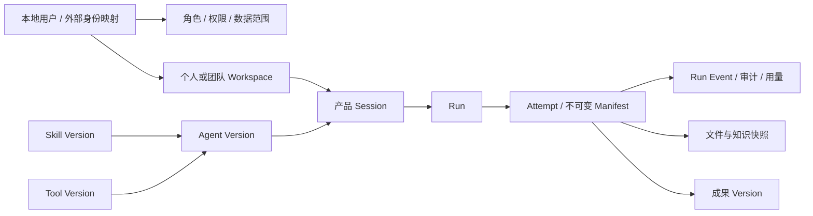

# 数据模型

PostgreSQL 是产品事实来源。本文解释关系和不变量；准确字段、索引、外键及升级顺序以 [SQL 迁移](../server/migrations/) 为准，不维护另一份 DDL 副本。

## 领域关系

## 存储与约束

| 领域 | 主要表 | 关键不变量 |
| --- | --- | --- |
| 身份 | `users`、`authentication_sessions`、`oidc_login_transactions` | 本地用户主键稳定；AI Hub `external_user_id` 是外部稳定键，Subject 是协议映射；Token 服务端加密，浏览器仅持有不透明 Cookie |
| 授权 | `roles`、`user_roles`、`data_scope_grants` | 本地角色、权限、范围独立于 AI Hub；过期角色不生效，变更增加本地授权版本；请求重新计算 |
| 身份同步 | `application_admin_bootstrap_claims`、`identity_directory_sync_state` | Bootstrap 按应用/环境幂等消费；目录持久化 opaque cursor，停用撤销 Session，保留本地角色历史 |
| 空间 | `workspaces`、`workspace_members`、`workspace_capability_grants` | 每位用户唯一默认个人空间；团队资源按成员及能力授权，默认拒绝 |
| 会话 | `sessions`、`messages` | 对话必须归属空间并锁定 Agent Version；产品 Session 不等于 DSH Session |
| 能力版本 | `agents`、`agent_versions`、`skills`、`skill_versions`、`tools`、`tool_versions`、绑定表 | 发布版本不可覆盖；Agent 引用精确 Skill/Tool 版本，Skill 依赖不能扩大 Tool Allowlist |
| 模型 | `model_providers`、`provider_models`、`model_routes`、`credential_refs` | 只存凭据引用；平台解析路由，Attempt 固定快照，Agent 不配置模型策略 |
| 运行 | `runs`、`run_attempts`、`run_events` | 幂等创建、按序 Attempt、不可变 Manifest；事件先落库，再按持久化全 Run 顺序推送与续传 |
| Runtime | `runtimes`、`runtime_configurations` | 健康与调度状态分离，配置追加版本；Runtime 不等于每次执行的 Worker |
| 文件 | `file_objects`、`file_extractions`、`run_input_files`、`workspace_files`、`workspace_file_versions` | 存储键不用用户文件名；每次 Attempt 固定原文件与解析版本，只读输入，重新鉴权；团队共享文件的逻辑文件/版本层不覆盖不可变对象，历史 Run 引用仍指向实际使用的对象（AC-13） |
| 知识 | `knowledge_sources`、`knowledge_documents`、`run_knowledge_sources` | 来源、版本、生效时间、权限与摘要可追溯；合成来源显式标记 |
| 成果 | `artifacts`、`artifact_versions` | 新增版本，不覆盖旧文件；下载检查空间与对象权限 |
| 运营 | `audit_events`、`model_usage_events`、`operational_events` 视图 | 可按 User/Workspace/Session/Run/Attempt 追踪；运营投影不含提示词、业务正文或密钥 |

所有查询先限定租户，再检查用户、角色、空间和数据范围；跨对象外键与唯一约束按迁移落实，不能仅依靠前端过滤。

## 运行终态与恢复

Run 和 Attempt 的普通状态转换不能从终态回退。只有失败 Run 接受显式重试：同一事务中创建新 Attempt 并重新排队，原 Attempt 和事件保持不变；成功或取消的 Run 不重试。

服务重启将失去 Worker 的活动 Attempt 收敛为失败，只恢复尚未执行的排队 Manifest。浏览器使用稳定事件 ID 续传，不能用单 Attempt 的序号替代全 Run 顺序。

## 迁移入口

- [基础模型](../server/migrations/0001_m2_platform.sql) 与后续运行、能力和文件迁移。
- [对象授权](../server/migrations/0010_m4_authorization.sql)、[个人空间](../server/migrations/0013_m5_personal_workspaces.sql)。
- [服务端 Session](../server/migrations/0014_m6_ai_hub_sso.sql)、[本地授权](../server/migrations/0016_identity_owned_authorization.sql)、[业务员工](../server/migrations/0017_business_user_directory.sql)、[升级对账](../server/migrations/0018_fail_closed_directory_reconciliation.sql)。
- [多入口 OIDC 事务](../server/migrations/0020_multi_origin_oidc.sql)、[团队共享文件逻辑移除](../server/migrations/0024_workspace_file_removal.sql)、[逻辑文件与版本](../server/migrations/0025_workspace_file_versions.sql)。

新增变更使用新的顺序迁移，保留已应用迁移。应用回滚不会自动降低 Schema，至少保持上一版本兼容；破坏性清理需独立安排。操作流程见 [部署手册](deployment/mac-mini-deployment-runbook.md)。

## 数据保留与安全

模型隐藏推理和密钥不进入数据库、日志或 SSE。消息正文与运营审计分开管理；管理端治理摘要不等于开放全量业务消息读取。文件进入 Runtime 前执行权限、类型和路径校验，企业扫描、保留期、备份与清理策略需要按环境落实。

完整契约见 [内部端口与契约](contracts/internal-ports.md)，回归和真实验收要求见 [开发与测试](testing/development.md)。
