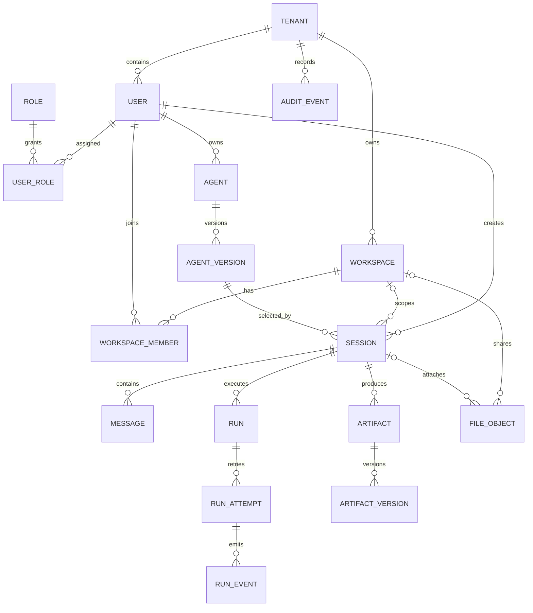

# dsh-work MVP 数据模型（M0 基线）

版本：V0.1
数据库：PostgreSQL
状态：逻辑模型已冻结，物理 DDL 在 M2 输出

## 1. 建模原则

- 所有业务数据均带 `tenant_id`；任何查询必须先限定租户，再应用角色和数据范围。
- 用户只来自企业 SSO，同一企业内通过稳定的 `external_subject` 关联；平台另保留独立超级管理员入口。
- MVP 只创建团队工作空间，不创建个人工作空间。独立新对话的 `workspace_id` 为 `NULL`。
- 对话是员工工作对象；管理端 Session 页面仅用于状态、用量、安全与审计治理，不建设可任意浏览全量消息的页面。
- Agent、Skill 和 Runtime 配置使用不可变版本或变更快照；已运行任务可回溯到执行时配置。
- 删除优先软删除或归档；审计事件和成果版本不可原地覆盖。

## 2. 核心关系



## 3. 表与关键字段

### 3.1 身份与权限

| 表 | 关键字段 | 约束与说明 |
|---|---|---|
| `tenants` | `id`, `name`, `status` | 企业租户根对象 |
| `users` | `id`, `tenant_id`, `external_subject`, `display_name`, `department_id`, `status` | `unique(tenant_id, external_subject)`；不存 SSO 密码 |
| `roles` | `id`, `tenant_id`, `code`, `name`, `permissions` | `code` 在租户内唯一；权限采用受控枚举 |
| `user_roles` | `tenant_id`, `user_id`, `role_id`, `valid_until` | 联合主键；支持临时授权 |
| `data_scope_grants` | `id`, `tenant_id`, `subject_type`, `subject_id`, `scope_code`, `scope_value` | 主体可为用户、角色或 Workspace |

独立超级管理员不复用企业用户登录入口。其凭据存放于外部身份系统或专用密钥系统，平台仅保存不可逆主体引用和审计标识。

### 3.2 团队工作空间

| 表 | 关键字段 | 约束与说明 |
|---|---|---|
| `workspaces` | `id`, `tenant_id`, `name`, `description`, `created_by`, `status`, `archived_at` | `workspace_type` MVP 固定为 `team`；不绑定创建人所有权 |
| `workspace_members` | `workspace_id`, `user_id`, `member_role`, `added_by`, `joined_at` | 联合主键；成员角色为 `owner/admin/member/viewer` |
| `workspace_capability_grants` | `workspace_id`, `capability_type`, `capability_version_id` | 绑定允许使用的 Agent/Skill/工具版本 |

创建者默认成为 Workspace `owner`，但 Workspace 属于企业租户。创建者离职或移除后必须先转移至少一个 owner。

### 3.3 Agent、Skill、工具与连接器

| 表 | 关键字段 | 约束与说明 |
|---|---|---|
| `agents` | `id`, `tenant_id`, `name`, `description`, `welcome_message`, `owner_user_id`, `created_by`, `status` | 创建者自动成为负责人，创建页不显示负责人字段 |
| `agent_versions` | `id`, `agent_id`, `version`, `system_prompt`, `visible_role_ids`, `data_scopes`, `status`, `published_at` | 不包含 Agent 级模型策略；发布后不可变 |
| `agent_version_skills` | `agent_version_id`, `skill_version_id` | 精确绑定 Skill 版本 |
| `agent_version_tools` | `agent_version_id`, `tool_version_id` | 一期仅允许平台预置工具 |
| `skills` | `id`, `tenant_id`, `key`, `name`, `owner_user_id`, `status` | `key` 由名称生成并保证租户内唯一，创建后稳定 |
| `skill_versions` | `id`, `skill_id`, `version`, `instructions`, `manifest`, `status` | 发布后不可变 |
| `tools` | `id`, `tenant_id`, `key`, `name`, `source`, `status` | 一期 `source=platform`，管理端只读 |
| `tool_versions` | `id`, `tool_id`, `version`, `input_schema`, `output_schema`, `risk_level` | 工具契约版本化 |
| `connectors` | `id`, `tenant_id`, `key`, `name`, `connector_type`, `credential_ref`, `status` | 一期只使用预置连接器；只存凭据引用 |

### 3.4 对话、运行与事件

| 表 | 关键字段 | 约束与说明 |
|---|---|---|
| `sessions` | `id`, `tenant_id`, `workspace_id`, `created_by`, `agent_version_id`, `title`, `status`, `last_active_at` | `workspace_id` 可空；员工只能看到自己或所在 Workspace 可见 Session |
| `messages` | `id`, `session_id`, `role`, `content`, `content_classification`, `created_at` | `role` 为 `user/assistant/system/tool`；不持久化隐藏推理 |
| `runs` | `id`, `session_id`, `requested_by`, `idempotency_key`, `status`, `current_attempt_id`, `created_at` | `unique(session_id, requested_by, idempotency_key)` |
| `run_attempts` | `id`, `run_id`, `attempt_no`, `runtime_id`, `manifest`, `status`, `started_at`, `ended_at`, `error_code` | 每次重试新增记录；`unique(run_id, attempt_no)` |
| `run_events` | `id`, `run_id`, `attempt_id`, `sequence`, `event_type`, `display_message`, `safe_metadata`, `trace_id`, `occurred_at` | `unique(attempt_id, sequence)` 与 `unique(id)`；符合事件 Schema |
| `approvals` | `id`, `run_id`, `event_id`, `requested_action`, `risk_level`, `status`, `resolved_by`, `resolved_at` | 高风险工具调用必须关联审批 |

Run 状态：

```text
queued → running → completed
              ├→ failed → retry（新 Attempt）
              └→ cancel_requested → cancelled
queued ───────────────────────────→ cancelled
```

完成、失败、取消为终态。终态不可回退；重试不复活原 Attempt。

### 3.5 Runtime、文件、成果、用量与审计

| 表 | 关键字段 | 约束与说明 |
|---|---|---|
| `runtimes` | `id`, `tenant_id`, `node_name`, `runtime_version`, `status`, `capacity`, `last_heartbeat_at` | Runtime 是可调度执行实例，不等同于单个 DSH 子进程 |
| `runtime_configurations` | `tenant_id`, `revision`, `concurrency_limit`, `timeout_seconds`, `sandbox_policy`, `updated_by` | 乐观锁更新；每次修改写审计 |
| `file_objects` | `id`, `tenant_id`, `workspace_id`, `session_id`, `storage_key`, `original_name`, `mime_type`, `size_bytes`, `sha256`, `scan_status` | 二者至少一个上下文可见；下载前再鉴权 |
| `artifacts` | `id`, `tenant_id`, `workspace_id`, `session_id`, `name`, `artifact_type`, `created_by` | 成果逻辑对象 |
| `artifact_versions` | `id`, `artifact_id`, `version_no`, `file_object_id`, `source_run_id`, `created_at` | 只新增版本，不覆盖 |
| `model_usage_events` | `id`, `tenant_id`, `run_id`, `provider`, `model`, `input_tokens`, `output_tokens`, `cost_amount`, `occurred_at` | Token 原始计量事件；费用币种另存 |
| `audit_events` | `id`, `tenant_id`, `actor_type`, `actor_id`, `action`, `object_type`, `object_id`, `result`, `trace_id`, `safe_context`, `occurred_at` | 追加写；敏感值脱敏；不可由普通管理员删除 |

## 4. 索引基线

- `sessions(tenant_id, created_by, last_active_at desc)` 与 `sessions(tenant_id, workspace_id, last_active_at desc)`。
- `runs(session_id, created_at desc)`、`run_attempts(run_id, attempt_no desc)`。
- `run_events(attempt_id, sequence)`，用于 SSE 断点续传。
- `workspace_members(user_id, workspace_id)`，用于员工工作空间列表。
- `artifacts(tenant_id, workspace_id, created_at desc)` 与 `artifacts(session_id, created_at desc)`。
- `audit_events(tenant_id, occurred_at desc)`、`audit_events(trace_id)`、`audit_events(object_type, object_id)`。
- `model_usage_events(tenant_id, occurred_at)` 和 `model_usage_events(run_id)`。

所有唯一约束都必须包含 `tenant_id` 或通过父对象外键保证租户隔离。

## 5. 页面—API—数据映射

| 页面 | 主要 API | 主要表 | MVP 验收点 |
|---|---|---|---|
| 员工工作台 | `GET /session`、`POST /sessions` | `users`, `sessions` | 可发起独立新对话，不自动创建个人 Workspace |
| 对话页 | `POST /sessions/{id}/runs`、SSE Events、取消/重试 | `messages`, `runs`, `run_attempts`, `run_events` | 输入框固定底部；刷新可恢复；失败可重试 |
| 工作空间页 | `/workspaces`、`/{id}`、文件上传 | `workspaces`, `workspace_members`, `file_objects` | 顶部页签切换对话/共享文件/成果 |
| 成果库 | `/artifacts`、下载 | `artifacts`, `artifact_versions` | 仅可下载有权限的版本 |
| Agent 管理 | `/agents`、测试、发布 | `agents`, `agent_versions` | 负责人自动为创建者；欢迎语可空；无模型策略字段 |
| 能力管理 | `/skills`、`/tools`、`/connectors` | Skill/工具/连接器表 | Skill 标识自动生成；一期工具和连接器只读 |
| Runtimes | `/runtimes`、`/runtimes/configuration` | `runtimes`, `runtime_configurations` | 位于安全与运维；健康、容量和配置可追溯 |
| Session 治理 | `/sessions`、`/{id}` | `sessions`, `runs`, `model_usage_events`, `audit_events` | 默认不展示完整业务消息正文 |
| 工作空间管理 | `/workspaces`、成员接口 | Workspace 表 | Workspace 企业所有，支持 owner 转移 |

## 6. 保留与脱敏基线

- 具体保留天数由 D-07 确认；MVP 实现必须支持按数据类别配置，不把天数写死在代码中。
- 运行事件只保存可展示内容与安全元数据；模型隐藏推理不进入数据库、日志或 SSE。
- 文件在进入 Runtime 前必须完成类型、大小、病毒扫描和访问鉴权。
- 连接器凭据、模型密钥只保存密钥系统引用；错误信息不得回显凭据或完整请求头。
- 管理员查看 Session 内容属于敏感访问，应默认关闭；若后续启用，必须独立授权并写审计。

## 7. M2 物理模型出口条件

M2 创建迁移脚本前，必须完成 D-03（SSO）、D-06（数据分级）、D-07（保留周期）和 D-08（超级管理员入口）的企业确认；未确认项使用配置占位，不得形成不可逆硬编码。
