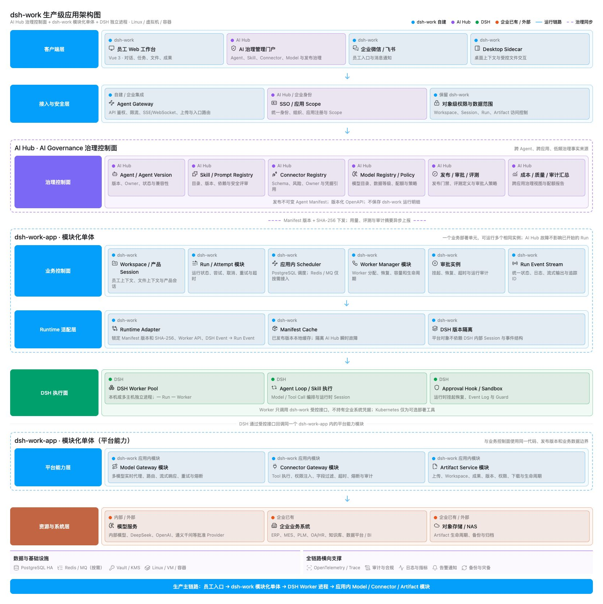
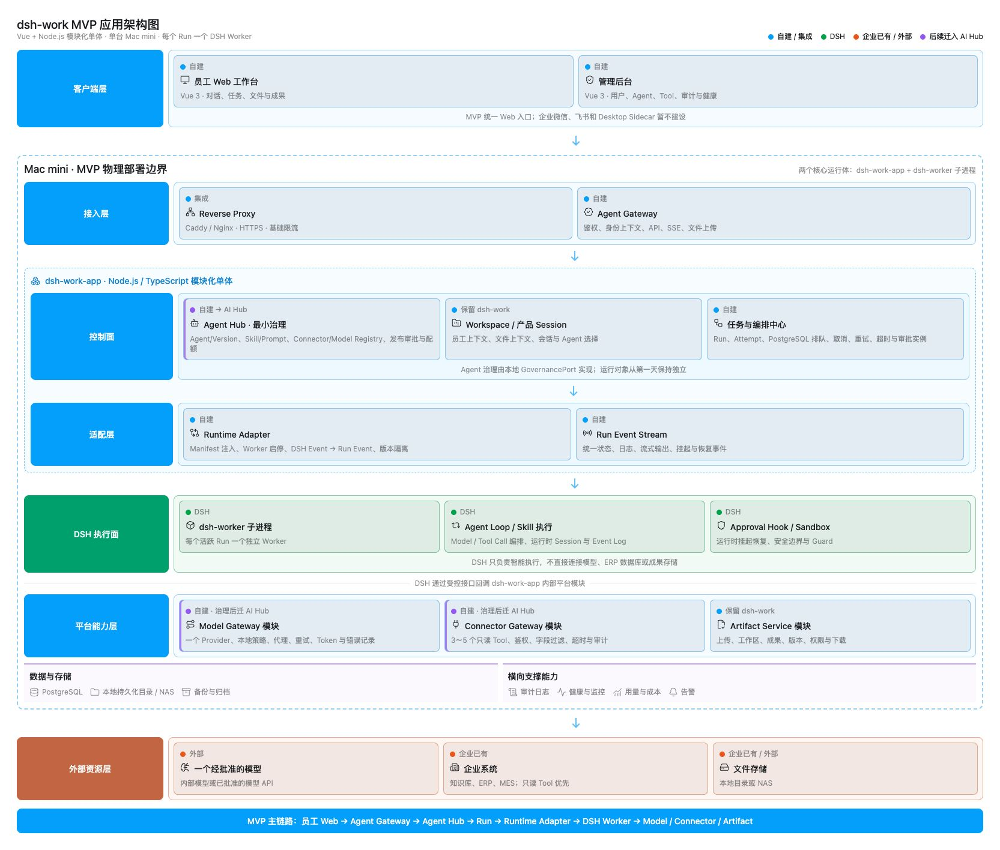

# dsh-work 产品架构方案（简化版）

**项目名称：** dsh-work
**产品名称：** dsh-work
**方案版本：** V1.8
**方案日期：** 2026-08-29
**前端技术栈：** Vue 3 + TypeScript + Vite + Element Plus
**Agent Runtime：** DeepSeek Harness（DSH，可替换）
**MVP 部署：** 公司内网 Mac mini
**实施计划：** [《dsh-work MVP 实施方案与计划》](dsh-work%20MVP%20实施方案与计划.md)

> 架构原则：10 个一级系统用于定义长期逻辑边界，不代表 10 个独立服务。dsh-work 业务应用在 MVP 和生产阶段均保持模块化单体；DSH Worker 使用独立进程隔离；达到治理门槛后，只把跨 Agent、跨应用的治理控制面迁入 AI Hub。

---

# 一、架构结论

dsh-work 是企业员工统一使用 AI Agent、企业知识、业务数据和文件处理能力的内网工作平台。

本方案按 **10 个一级逻辑系统** 划分。MVP 建设责任中，9 个属于 dsh-work 的自建或集成范围，1 个直接使用 DSH；MVP 验证后，02、03、04、07、08、10 中的跨应用治理部分可按门槛迁入或复用 AI Hub。企业已有系统和模型 Provider 作为外部依赖接入，不计入 dsh-work 自建系统数量。

除 DSH Worker 进程、AI Hub 和企业已有基础设施外，全部 dsh-work 代码默认长期保存在同一个代码库中。01 的员工工作台与管理后台使用两个独立 Vue 构建产物；02～05、07～10 的后端业务模块继续保存在同一个 `dsh-work-app` 部署单元中。生产环境可以运行多个相同后端实例，但不因此拆分业务微服务。

标记说明：

- `【自建】`：需要 dsh-work 团队设计、开发和维护；
- `【自建/集成】`：业务模块由 dsh-work 自建，数据库、队列等采用成熟产品并负责集成运维；
- `【DSH】`：复用 DSH Runtime，本项目只通过 Runtime Adapter 接入；
- `【企业已有/外部】`：对接现有企业系统、基础设施或模型服务，不在本项目中重建；
- `【后续迁入 AI Hub】`：MVP 先在 dsh-work 中实现最小能力，达到复用和治理门槛后，将治理事实迁入 AI Hub；
- `【保留 dsh-work】`：属于产品运行状态或高频执行链路，不迁入 AI Hub 核心后端。

完整架构与演进责任图：

    员工 / 管理员
      │
      ▼
    01.【自建】企业 AI 工作台
    ├── 员工工作台 Vue Web（独立构建，MVP）
    ├── 管理后台 Vue Web（独立构建，MVP；AI 治理页面后续迁入 AI Hub 门户）
    ├── 共享 Design Token 与无业务状态的基础展示组件
    ├── 企业微信 / 飞书入口（后续）
    └── Desktop Sidecar（后续）
      │
      ▼
    02.【自建】Agent Gateway
    ├── SSO / LDAP 接入（后续可复用 AI Hub）
    ├── API 鉴权与限流
    ├── 身份、应用 Scope（后续可复用 AI Hub）
    ├── dsh-work 对象级权限与数据范围（保留 dsh-work）
    └── 文件上传与 SSE 连接
      │
      ▼
    03.【自建→部分迁入 AI Hub】Agent Hub
    ├── Agent / Agent Version【后续迁入 AI Hub】
    ├── Skill / Prompt Registry【后续迁入 AI Hub】
    ├── Tool / Connector Registry【后续迁入 AI Hub】
    ├── Model Registry / Policy【后续迁入 AI Hub】
    ├── 发布、审批、评测与配额【后续迁入 AI Hub】
    ├── 成本与质量汇总【后续迁入 AI Hub】
    └── Workspace 与产品 Session【保留 dsh-work】
      │
      ▼
    04.【自建】任务与编排中心
    ├── Run / Runtime Attempt
    ├── Queue / Scheduler
    ├── 取消、重试与超时
    ├── 审批策略、审批人与审计【后续迁入 AI Hub】
    ├── 审批实例、挂起与恢复【保留 dsh-work】
    └── 标准 Run Event Stream
      │
      ▼
    05.【自建】Runtime Adapter
    ├── Runtime Manifest
    ├── Worker 启停与生命周期
    ├── DSH Event → Run Event 转换
    └── DSH 版本与内部对象隔离
      │
      ▼
    06.【DSH】DSH Worker Pool
    ├── Agent Loop
    ├── Model Call / Tool Call 编排
    ├── Skill 执行
    ├── Runtime Session / Event Log
    ├── Approval Hook（挂起与恢复）
    └── Sandbox / Guard
      │
      ├────────► 07.【自建】企业 Model Gateway
      │           ├── 模型目录、数据等级、配额策略【后续迁入 AI Hub】
      │           ├── 实时代理、路由、流式响应、重试与熔断【保留 dsh-work 应用内模块】
      │           └──【企业已有/外部】内部模型 / 已批准外部模型
      │
      ├────────► 08.【自建】企业 Connector Gateway
      │           ├── Connector 目录、Schema、风险、Owner、凭据引用【后续迁入 AI Hub】
      │           ├── Tool 执行、权限注入、字段过滤、重试与熔断【保留 dsh-work 应用内模块】
      │           └──【企业已有】知识库 / ERP / MES / PLM / OA / 数据平台
      │
      └────────► 09.【自建】Artifact Service
                  ├── 上传文件、成果、版本、权限与下载【保留 dsh-work 应用内模块】
                  └──【企业已有/外部】NAS / 对象存储

    全链路横切能力
      └────────── 10.【自建/集成】平台数据与运维
                  ├── PostgreSQL
                  ├── Queue / MQ（按需）
                  ├── Secret / Vault（按需）
                  └── 日志、指标、Trace、备份与告警

一级系统清单：

| 编号 | 一级系统 | MVP 形态 | 完整架构形态 | AI Hub 演进备注 |
|---:|---|---|---|---|
| 01 | 企业 AI 工作台 | 员工工作台与管理后台独立构建，共享前端 packages | 两个 Web 应用、共享前端包及其他员工入口 | 员工工作台保留；AI 治理页面迁入 AI Hub 门户 |
| 02 | Agent Gateway | Reverse Proxy + Node.js 中间件 | Reverse Proxy + dsh-work 应用内 Gateway；可复用企业网关 | 身份、应用注册和 Scope 复用 AI Hub；对象级权限保留 dsh-work |
| 03 | Agent Hub | 模块化单体内部模块 | AI Hub AI Governance + dsh-work Workspace/Session | Agent、Skill、Prompt、Connector、Model 治理迁入；Workspace/Session 保留 |
| 04 | 任务与编排中心 | Run 模块 + PostgreSQL 状态表 | dsh-work 应用内 Run、Scheduler、Worker Manager；外部队列按需 | 审批策略与审批人迁入；Run、Attempt、审批实例和事件保留 |
| 05 | Runtime Adapter | 单体内部模块 | dsh-work 应用内 Runtime Adapter | 不迁入 AI Hub，不独立为业务服务 |
| 06 | DSH Worker Pool | 每个 Run 启动 DSH 子进程 | 本机或多主机独立 Worker 进程池；Kubernetes 可选 | DSH 执行面，不迁入 AI Hub，也不属于业务微服务 |
| 07 | 企业 Model Gateway | 单体内部模块、一个 Provider | AI Hub 模型治理 + dsh-work 应用内 Model Gateway 模块 | 模型目录、策略、配额迁入；实时代理与路由保留应用内 |
| 08 | 企业 Connector Gateway | 单体内部模块、3～5 个只读 Tool | AI Hub Connector 治理 + dsh-work 应用内 Connector Gateway 模块 | Registry、Schema、风险和凭据引用迁入；Tool 执行保留应用内 |
| 09 | Artifact Service | 单体模块 + 本地目录/NAS | dsh-work 应用内 Artifact 模块 + NAS/对象存储适配器 | 保留应用内模块，只向 AI Hub 上报治理摘要 |
| 10 | 平台数据与运维 | PostgreSQL、结构化日志、备份 | PostgreSQL 高可用、共享存储、Secret、OpenTelemetry；Queue 按需 | 身份、应用、权限及汇总审计复用 AI Hub；运行基础设施保持独立 |

MVP 建设数量汇总：

| 类型 | 数量 | 范围 |
|---|---:|---|
| dsh-work 自建或集成 | 9 个 | 01～05、07～10 |
| DSH Runtime | 1 个 | 06 |
| 企业已有/外部依赖 | 4 类 | 身份系统、模型服务、业务系统、存储与基础设施 |
| 后续 AI Hub 治理平台 | 1 个 | 不计入 MVP；达到治理门槛后承接 AI Governance |

## 1.1 AI Hub 演进边界

AI Hub 适合承接低频、跨 Agent、跨应用、需要统一版本和审计的治理控制面；不承接高频、低延迟、故障率和资源消耗较高的运行执行面。

| 演进类型 | 模块 | 目标归属 |
|---|---|---|
| 整体迁入治理控制面 | Agent/Agent Version、Skill/Prompt Registry、发布审批、评测定义、配额、成本与质量汇总 | AI Hub 的 AI Governance 领域 |
| 只迁治理部分 | Connector Registry、Model Registry、审批策略、身份、应用 Scope、凭据引用 | 治理事实进入 AI Hub；执行仍由 dsh-work 应用内模块承担 |
| 始终保留运行面 | Workspace、产品 Session、Run、Attempt、Run Event、Runtime Adapter、DSH Worker、Model/Connector Gateway、Artifact | dsh-work 模块化单体与 DSH Worker 进程 |

目标协作关系：

~~~mermaid
flowchart TB
    subgraph AIH[AI Hub：AI Governance 控制面]
        AG[Agent / Skill / Prompt]
        CG[Connector / Model Registry]
        PG[发布 / 审批 / 评测 / 配额]
        UG[成本 / 质量 / 审计汇总]
    end

    MANIFEST[不可变 Agent Manifest 版本 + SHA-256]

    subgraph DWORK[dsh-work-app：模块化单体]
        WS[Workspace / 产品 Session]
        RUN[Run / Attempt / Event]
        ADAPTER[Runtime Adapter]
        MG[Model Gateway 模块]
        CONN[Connector Gateway 模块]
        ART[Artifact Service 模块]
    end

    DSH[DSH Worker 独立进程池]

    subgraph RESOURCE[企业已有 / 外部]
        MODEL[模型服务]
        SYSTEM[知识库 / ERP / MES / PLM / OA]
        STORE[NAS / 对象存储]
    end

    AIH -->|发布| MANIFEST
    MANIFEST -->|按版本读取并缓存| RUN
    WS --> RUN
    RUN --> ADAPTER
    ADAPTER --> DSH
    DSH --> MG
    DSH --> CONN
    DSH --> ART
    MG --> MODEL
    CONN --> SYSTEM
    ART --> STORE
    RUN -. 用量、评测和审计摘要 .-> AIH
~~~

迁移必须满足以下约束：

- MVP 从第一天定义 `GovernancePort`，本地实现和 AI Hub Client 使用同一契约；
- Agent、Skill、Connector、Model 和 Prompt 使用稳定 ID、不可变版本及内容摘要；
- AI Hub 发布不可变 Agent Manifest，Run 创建时锁定 Manifest 版本和 SHA-256；
- Runtime 缓存已发布 Manifest，AI Hub 不进入每一步模型调用或 Tool Call 的同步关键路径；
- AI Hub 短时不可用时，已开始的 Run 必须继续；新版本发布和治理变更暂停；
- 运行明细保留在 dsh-work，AI Hub 只接收必要的用量、评测、成本和审计汇总；
- 没有出现跨 Agent 复用、多 Owner、统一审批、敏感 Connector 或模型配额需求时，不为迁移而迁移。

边界必须保持明确：

- DSH 负责一次 Attempt 内的智能执行，不负责企业产品控制面；
- MVP 中 Agent 治理由 dsh-work 最小实现；达到迁移门槛后，Agent、Skill、Connector、Model、审批策略和治理汇总进入 AI Hub；
- Workspace、产品 Session、Run、Attempt、运行权限、审批实例和 Run Event 始终由 dsh-work 管理；
- DSH 中的 Runtime Session 不等于 dsh-work 的产品 Session；
- DSH 只发起 Tool Call，企业数据权限、字段过滤和真实 Connector 执行由 Connector Gateway 负责；
- DSH 的 Approval Hook 只负责运行时挂起与恢复；MVP 的审批策略由任务与编排中心管理，后续策略和审批人迁入 AI Hub，审批实例与运行审计保留 dsh-work；
- Model Gateway、Connector Gateway 和 Artifact Service 均不是 DSH 的组成部分，默认作为 `dsh-work-app` 内部模块运行。

MVP 和生产阶段都不把 9 个自建系统分别部署，而是保持一个 dsh-work 模块化单体；DSH 始终作为独立进程或进程池运行。随着用户量、Agent 数量和安全要求增长，可按证据增加应用多实例、共享队列、对象存储、多主机 Worker、Secret 和统一可观测，但不把业务模块拆成微服务。

演进总览：

~~~mermaid
flowchart LR
    A[MVP Mac mini 模块化单体] --> B[生产化增强 队列与对象存储]
    B --> C[AI Hub 治理升级 Manifest 与统一治理]
    C --> D[容量与隔离增强 单体多实例 + Worker 进程池]
    D --> E[长期生产架构 AI Hub 治理 + dsh-work 模块化单体]
~~~

## 1.2 员工工作台、管理后台与服务端架构规范

### 1.2.1 第一性原理

三者边界由以下不可违背的事实推导：

1. 员工与管理员的目标、操作频率、权限和发布节奏不同，因此员工工作台与管理后台必须是两个独立前端应用；
2. User、Workspace、Session、Run、Agent Version、Artifact、权限和审计只能存在一个权威事实来源，因此不能按前端拆出两套业务后端或数据库；
3. 浏览器不可信，身份、数据范围、对象权限、审批、幂等和审计必须由服务端执行；
4. 管理后台属于治理控制面，员工工作台属于产品体验面，DSH Worker 属于运行执行面，三者不能互相越权；
5. 只有独立扩缩容、故障隔离、团队所有权或发布节奏产生可验证收益时才允许拆服务，前端独立构建不等于后端微服务化。

由此确定 MVP 和长期默认形态：**两个独立前端、两个独立 API 门面、一个共享业务事实的 Node.js 模块化单体，以及独立的 DSH Worker 进程。**

~~~mermaid
flowchart TB
    IDP[企业 SSO / IdP]
    EMP[员工]
    ADM[管理员]
    WW[workbench-web 独立构建与发布]
    AW[admin-web 独立构建与发布]
    WAPI[Workbench API /api/workbench/v1]
    AAPI[Admin API /api/admin/v1]

    subgraph APP[dsh-work-app：一个 Node.js 模块化单体]
        AUTH[Identity / Authorization]
        DOMAIN[Workspace / Session / Run / Approval]
        GOV[Agent / Skill / Tool / Connector / Model Policy]
        OUTPUT[Artifact / Audit / Usage / Health]
        ADAPTER[Runtime Adapter]
        GATEWAY[Model / Connector Gateway]
    end

    DB[(PostgreSQL)]
    STORE[文件存储 / NAS]
    DSH[DSH Worker Pool 独立进程]
    EXT[模型与企业业务系统]

    EMP --> WW
    ADM --> AW
    IDP --> WW
    IDP --> AW
    WW --> WAPI
    AW --> AAPI
    WAPI --> AUTH
    WAPI --> DOMAIN
    AAPI --> AUTH
    AAPI --> GOV
    AAPI --> OUTPUT
    DOMAIN --> DB
    GOV --> DB
    OUTPUT --> DB
    OUTPUT --> STORE
    DOMAIN --> ADAPTER
    ADAPTER --> DSH
    DSH --> GATEWAY
    GATEWAY --> EXT
~~~

### 1.2.2 三方职责边界

| 边界 | 必须负责 | 明确禁止 |
|---|---|---|
| 员工工作台 | 对话、工作空间、文件、Run 状态、审批确认和成果体验 | Agent 治理、真实权限判定、直接访问 DSH 或企业系统 |
| 管理后台 | Agent、Skill、预置 Tool/Connector、Runtime、Session、团队工作空间、权限、审计、模型用量和系统健康 | 复用员工端运行状态、直接修改数据库、直接启动 DSH Worker |
| Workbench API | 面向员工的聚合 DTO、Session/Run 命令、文件与成果访问、SSE | 暴露治理内部结构或相信浏览器传入的用户与数据范围 |
| Admin API | 面向管理员的治理 DTO、发布、审批策略、审计和运维查询 | 绕过领域规则修改事实对象 |
| 领域模块 | 维护唯一业务事实、事务、权限、幂等与审计 | 依赖 Vue、页面状态或具体前端路由 |
| Runtime Adapter / DSH | 执行 Attempt、转换运行事件、调用受控 Gateway | 成为产品数据库、保存长期凭据或自行扩大权限 |

### 1.2.3 前端工程规范

员工工作台和管理后台必须独立维护 Router、Pinia、API Client、页面状态、环境变量和构建产物。两者不得互相引用应用源码，不得共享 Pinia 实例、浏览器角色状态或业务 Store。

共享包只承担受控的编译期复用：

    apps/
    ├── workbench-web/
    │   └── Router / Store / API Client / Views
    └── admin-web/
        └── Router / Store / API Client / Views

    packages/
    ├── design-tokens/          # 颜色、字号、间距和圆角
    ├── ui-core/                # 无状态基础组件和基础样式
    ├── workbench-components/   # 员工端展示组件，不读取应用 Store
    └── admin-components/       # 管理端展示组件，不读取应用 Store

约束如下：

- `ui-core` 不得导出 Pinia、业务 Store、Mock API、用户角色状态或完整服务端领域模型；
- packages 中的组件通过 Props、Events 和 Slots 工作，不直接依赖应用 Router 或业务 Store；
- 两个前端分别维护面向自身 API 的 DTO；正式阶段由各自 OpenAPI 契约生成 Client 和类型；
- 员工端只调用 `/api/workbench/v1/*`，管理端只调用 `/api/admin/v1/*`；
- 两个应用可以使用同一个企业身份源，但使用独立 Client/Scope；不得通过共享 `localStorage` 实现 SSO；
- 共享包变更必须同时通过两个应用的 typecheck、lint 和 build。

### 1.2.4 服务端工程规范

两个 API 门面是同一 Node.js 模块化单体中的 HTTP 边界，不是两个独立业务服务。推荐代码边界：

    server/src/
    ├── http/
    │   ├── workbench/          # /api/workbench/v1
    │   └── admin/              # /api/admin/v1
    ├── modules/
    │   ├── identity/
    │   ├── authorization/
    │   ├── workspaces/
    │   ├── sessions/
    │   ├── runs/
    │   ├── approvals/
    │   ├── agents/
    │   ├── capabilities/
    │   ├── artifacts/
    │   └── audit/
    ├── gateways/
    │   ├── model/
    │   ├── connector/
    │   └── storage/
    └── runtime/
        └── dsh-adapter/

服务端必须遵守：

- API 门面只负责协议、身份上下文、参数校验和 DTO 转换，业务规则进入领域模块；
- 两个门面复用同一权限、审计和领域事实，不复制 User、Workspace、Agent 或 Run 数据；
- PostgreSQL 是产品事实来源；DSH Session Log、浏览器 Store 和缓存都不能替代数据库；
- Run 创建时锁定 Agent Manifest、权限快照和数据范围；执行过程通过 Run Event/SSE 返回前端；
- 管理端写操作必须具备服务端权限、幂等、审计，高风险操作增加审批；
- Model、Connector、Artifact 通过应用内 Gateway 访问，前端和 DSH 都不能绕过 Gateway；
- MVP 可以使用内存 Mock Repository 验证 HTTP 边界，但必须明确标记为 Prototype Adapter，并可被 PostgreSQL Repository 替换。

### 1.2.5 身份、部署与演进

- 员工和管理员来自同一企业 IdP，同一人员使用稳定 User ID；Workbench 与 Admin 使用不同 Audience/Scope；
- 独立超级管理员只作为初始化和 SSO 故障时的应急账号，强制 MFA、来源限制和完整审计；
- Reverse Proxy 分别托管两个静态应用，并将两套 `/api` 路由转发到同一个 `dsh-work-app`；
- 管理后台不可用不应影响已开始的 Run；DSH Worker 异常退出不得导致 Node.js API 进程退出；
- 后续将治理迁入 AI Hub 时，Admin API 通过 `GovernancePort` 切换实现，员工工作台、Run 与 DSH 执行链保持不变。

### 1.2.6 原型实施基线

前端交互原型也必须遵守最终依赖方向。原型期允许服务端以 Mock 数据和内存 Repository 返回结果，但不再允许两个前端从共享包直接读取同一份 Mock Store。原型验收至少满足：

1. 两个应用分别创建 Pinia 并维护 Store；
2. 两个应用分别通过 Workbench/Admin API Client 读取数据；
3. 两套 API 路径由同一个可运行 Node.js 进程提供；
4. `ui-core` 与业务组件包保持无应用状态；
5. 服务端健康接口明确返回 `prototype-memory`，不得把 PostgreSQL、SSO 或 DSH 标记为已接入；
6. lint、typecheck、build、API 冒烟和两个前端浏览器主链路全部通过。

当前原型已经提供 `pnpm check:architecture` 作为依赖方向守卫，持续禁止应用互相引用、前端直连服务端实现，以及共享 packages 引入 Pinia 业务状态或应用 Router。

---

# 二、产品范围

## 2.1 MVP 核心场景

1. 企业知识查询；
2. ERP、MES 只读业务查询；
3. Excel、CSV、PDF、Word 文件分析；
4. Markdown、XLSX、DOCX、PDF 报告和成果交付。

## 2.2 MVP 产品形态

- 员工端只有一个 dsh-work Assistant；
- 使用内网浏览器访问；
- 支持文件上传、连续对话、任务状态、失败重试和成果下载；
- 管理端提供用户、权限、Agent Version、Tool、审计和系统健康管理；
- Agent、Skill 和 Tool 通过固定版本配置发布。

## 2.3 MVP 不实现

- PPT 或其他演示文稿生成；
- 多 Agent 市场；
- 可视化 Agent Builder；
- 企业微信或飞书员工入口；
- 员工自由安装插件或 MCP；
- 任意 Shell 和 SQL；
- ERP 正式写入；
- 跨天无人值守任务；
- 桌面客户端和员工本地 Runtime；
- 业务微服务、Kubernetes、Redis、MinIO 和 Vault。

---

# 三、核心对象与职责

## 3.1 产品对象

| 对象 | 含义 | 关键规则 |
|---|---|---|
| User | 企业员工或管理员 | 绑定部门、角色和数据范围 |
| Agent | 对员工提供的业务能力 | MVP 只发布一个 Assistant |
| Agent Version | Prompt、Skill、Tool 和策略的确定版本 | 发布后不可变，Run 创建时锁定 |
| Workspace | 项目文件和工作上下文 | 个人或显式授权共享 |
| Session | 一个连续对话主题 | 包含多个 Run |
| Run | 用户一次提交对应的一次任务 | 可排队、取消、重试和超时 |
| Runtime Attempt | Worker 对某个 Run 的一次执行尝试 | 系统重试创建新 Attempt |
| Artifact | 生成的报告、表格或文档 | 支持版本、权限和来源追溯 |

## 3.2 对象关系

~~~mermaid
flowchart LR
    U[User] --> W[Workspace]
    W --> S[Session]
    S --> R[Run]
    R --> T[Runtime Attempt]
    R --> A[Artifact]
    AG[Agent] --> AV[Agent Version]
    AV --> R
~~~

## 3.3 dsh-work 与 DSH 的边界

| 平台侧（dsh-work / 后续 AI Hub）负责 | DSH 负责 |
|---|---|
| 身份、组织、角色和数据范围 | 单次任务的 Agent Loop |
| Agent 与版本发布 | 模型调用和 Tool Call 编排 |
| Workspace、Session 和 Run | Skill 执行 |
| 排队、取消、重试和超时 | 运行时上下文 |
| 审批策略、审批人和审计记录 | Approval Hook（运行时挂起与恢复） |
| Model、Tool 和 Artifact 治理 | Runtime Session Event Log |
| 文件、成果、审计和运营 | 基础 Sandbox 和 Guard |

左侧统一属于平台侧责任：MVP 主要由 dsh-work 承担，后续其中的治理部分可迁入 AI Hub，但不得下沉给 DSH。dsh-work 业务对象不得依赖 DSH 内部 Session、Preset、Profile 或事件结构。所有 Runtime 调用通过 Runtime Adapter 完成。

---

# 四、完整系统架构

## 4.1 总体架构

**图 4-1　dsh-work 生产级应用架构图**

图中使用颜色直接区分模块归属：蓝色为 dsh-work 自建运行平台，紫色为 AI Hub 治理控制面，绿色为 DSH 执行面，橙色为企业已有系统或外部依赖。实线表示高频运行链路，紫色虚线表示 Manifest 下发及用量、评测、审计摘要等治理同步。

图中业务控制面和平台能力层分成上下两个蓝色区域，仅用于展示 DSH 的调用方向；二者属于同一个 `dsh-work-app` 代码库、发布版本、业务部署单元和数据事务边界。

生产架构的关键边界是：AI Hub 负责跨 Agent、跨应用的治理事实；`dsh-work-app` 模块化单体独立持有 Workspace、产品 Session、Run、Attempt、审批实例及运行事件，并在应用内提供 Model Gateway、Connector Gateway 和 Artifact Service 模块；DSH Worker 独立进程负责单次智能执行。模块化边界用于隔离职责和依赖，不代表微服务或独立数据库。

## 4.2 分层职责

| 层级 | 主要组件 | 职责 |
|---|---|---|
| 用户体验层 | 员工 Web、管理后台 | 任务、文件、状态、成果和管理体验 |
| 接入与安全层 | AI Hub 身份、API Gateway、dsh-work 对象级权限 | 身份、入口安全、限流和访问控制 |
| 治理控制面 | AI Hub AI Governance | 管理 Agent、Skill、Prompt、Connector、Model、发布、评测和配额 |
| 产品控制面 | dsh-work Workspace、Session | 管理员工持续工作上下文 |
| 执行控制层 | Run、应用内 Scheduler、Worker Manager、Approval | 管理任务何时执行及如何恢复 |
| Runtime 层 | Runtime Adapter、DSH Worker Pool | 隔离 DSH 并完成单次智能执行 |
| 平台能力层 | 应用内 Model Gateway、Connector Gateway、Artifact Service | 统一接入模型、企业系统和成果 |
| 基础设施层 | 数据库、共享存储、按需队列、密钥和监控 | 持久化、调度、安全和可观测 |

## 4.3 完整任务流程

~~~mermaid
sequenceDiagram
    participant E as 员工
    participant W as Vue Web
    participant H as AI Hub Governance
    participant R as dsh-work Run 模块
    participant O as Scheduler / Worker Manager
    participant D as DSH Worker
    participant G as 应用内 Model/Connector Gateway
    participant A as 应用内 Artifact 模块

    E->>W: 提交任务和文件
    W->>R: 创建 Run
    R->>H: 读取或命中缓存的已发布 Manifest
    H-->>R: Agent Version + Manifest SHA-256
    R->>R: 锁定 Manifest 和运行权限
    R->>O: 进入队列
    O->>D: 创建隔离 Worker
    D->>G: 调用模型或类型化 Tool
    G-->>D: 返回受控结果
    D->>A: 发布成果
    D-->>R: 标准 Run Event 和结果
    R-->>W: 流式状态、结论和 Artifact
    W-->>E: 展示与下载
    R-->>H: 异步上报用量、评测和审计摘要
~~~

## 4.4 完整架构的安全边界

- 员工不能直接访问 DSH；
- Worker 不直接连接 ERP 数据库；
- 模型调用统一经过 Model Gateway；
- 企业 Tool 调用统一经过 Connector Gateway；
- 身份和数据范围由后端注入；
- Artifact 由平台管理版本和下载权限；
- AI Hub 只发布治理配置和 Manifest，不参与每一步模型或 Tool 调用；
- Model Gateway、Connector Gateway 和 Artifact Service 默认运行在 `dsh-work-app` 中，不运行在 AI Hub 核心 API 进程中；
- 一 Run 一 Worker 进程；采用 Kubernetes 时可映射为一 Run 一 Pod，但 Kubernetes 非必需；
- 高风险写操作必须通过审批和二次确认；
- DSH 可替换，业务对象和 API 不随 DSH 变化。

---

# 五、MVP 架构

## 5.1 MVP 设计目标

MVP 需要同时满足：

- 20～50 人部门试点；
- 3～5 个并发 Run；
- 使用一台 Mac mini；
- 不建设业务微服务；
- 保留完整架构的逻辑接口；
- 通过 GovernancePort 隔离本地治理实现；
- Agent、Skill、Connector、Model 和 Prompt 从第一天使用稳定 ID 与不可变版本；
- 能在后续平滑扩展应用实例、Worker 和基础设施。

## 5.2 MVP 部署架构

MVP 只有两个核心应用运行体：一个自建的 `dsh-work-app`，以及按 Run 启动的 DSH Worker 子进程。9 个自建一级系统在 MVP 和生产阶段都作为 `dsh-work-app` 内部逻辑模块存在，不拆成 9 个业务服务。

**图 5-1　dsh-work MVP 应用架构图**

图中蓝色模块均由 dsh-work 自建或集成，绿色模块直接使用 DSH，橙色模块为企业已有系统或外部依赖；带紫色标识的治理模块由 MVP 本地实现，达到治理门槛后迁入 AI Hub。图中的逻辑分层不会改变 MVP 的物理部署结论：所有自建模块仍合并在一个 Node.js 模块化单体中。

**MVP 物理部署与归属（文字基线）：**

    Mac mini
    ├──【自建/集成】reverse-proxy
    │   └── Caddy / Nginx、HTTPS、基础限流
    │
    ├──【自建】dsh-work-app（一个 Node.js 模块化单体）
    │   ├── 01 企业 AI 工作台：Vue Web / Admin
    │   ├── 02 Agent Gateway：鉴权、身份上下文、API、SSE（后续部分复用 AI Hub）
    │   ├── 03 Agent Hub：本地最小治理 + Workspace / Session
    │   ├── 04 任务与编排中心：Run、Attempt、排队、重试、超时
    │   ├── 05 Runtime Adapter：启动 DSH、转换事件、隔离版本
    │   ├── 07 Model Gateway 模块：本地策略 + 一个模型 Provider
    │   ├── 08 Connector Gateway 模块：本地 Registry + 实施团队预置的 3～5 个只读 Tool
    │   ├── 09 Artifact Service 模块：成果、版本和下载
    │   └── 10 平台模块：审计、用量、日志和备份
    │
    ├──【DSH】06 dsh-worker 子进程（每个活跃 Run 一个）
    │   ├── Agent Loop
    │   ├── Model / Tool Call 编排
    │   ├── Skill 执行
    │   ├── Runtime Session / Event Log
    │   └── Sandbox / Guard
    │
    ├──【自建/集成】PostgreSQL
    └──【企业已有/外部】本地持久化目录或 NAS

**MVP 运行调用关系（文字基线）：**

    员工浏览器
      │
      ▼
    【自建】dsh-work-app
      │  Agent Gateway → Agent Hub → 任务与编排中心
      │
      ▼
    【自建】Runtime Adapter
      │  启动独立子进程并注入 Runtime Manifest
      ▼
    【DSH】dsh-worker
      │
      ├── Model Call ──►【自建】Model Gateway 模块
      │                       └──►【外部】一个经批准的模型
      │
      ├── Tool Call ───►【自建】Connector Gateway 模块
      │                       └──►【企业已有】知识库 / ERP / MES
      │
      └── Artifact ────►【自建】Artifact Service 模块
                              └──►【企业已有/外部】本地目录 / NAS

这里的 Gateway 虽然在 MVP 中只是 `dsh-work-app` 内部模块，但 DSH 仍必须通过受控接口调用，不能直接连接模型、ERP 数据库或成果存储。

## 5.3 MVP 与完整架构的对应关系

| 编号与一级系统 | MVP 实现 | 后续升级方式 |
|---|---|---|
| 01 企业 AI 工作台 | 独立的 `workbench-web` 与 `admin-web`，共享 Design Token 和组件包 | 由 Reverse Proxy 分入口托管静态资源，并按需增加企业微信、飞书和 Sidecar |
| 02 Agent Gateway | Reverse Proxy + Node.js 中间件 | 身份和应用 Scope 复用 AI Hub；对象级权限继续由应用内 Gateway 管理 |
| 03 Agent Hub | 本地 GovernancePort + PostgreSQL；YAML/Git 只维护预置种子与 Bundle | 治理迁入 AI Hub；Workspace/Session 保留 dsh-work |
| 04 任务与编排中心 | Run 模块 + PostgreSQL 状态表 | 审批策略迁入 AI Hub；Run、Scheduler 和 Worker Manager 保持应用内模块，外部队列按需 |
| 05 Runtime Adapter | 应用内进程管理模块 | 保持 dsh-work 应用内模块 |
| 06 DSH Worker Pool | 每个 Run 启动 DSH 子进程 | 本机或多主机 Worker 进程池；Kubernetes 可选 |
| 07 企业 Model Gateway | 应用内模块、一个 Provider | 模型治理迁入 AI Hub；实时代理和路由保持应用内模块 |
| 08 企业 Connector Gateway | 应用内统一 Tool 调用管线；Tool 与 Connector 由实施团队通过代码或受控配置预置 | Connector 治理迁入 AI Hub；Tool 执行保持应用内模块 |
| 09 Artifact Service | 应用内模块 + 本地目录/NAS | 保持应用内模块，存储适配器可切换到对象存储 |
| 10 平台数据与运维 | PostgreSQL、结构化日志、数据库审计和备份 | 平台身份与治理汇总复用 AI Hub；运行基础设施保持独立 |

## 5.4 MVP 模块

| 模块 | MVP 功能 | AI Hub 演进 |
|---|---|---|
| Vue Web | 工作台、文件上传、对话详情、最近对话和成果下载 | 员工工作台保留 dsh-work |
| Vue Admin | Agent、Skill、预置 Tool/Connector、Runtimes、Session、团队工作空间、用户、权限、模型用量、审计和系统健康；不提供自定义 Tool/Connector 接入 | Agent 治理页面后续迁入 AI Hub 门户 |
| Identity | SSO 或内部账号、角色和数据范围 | 身份、组织、应用 Scope 后续复用 AI Hub |
| Agent Registry | 一个 dsh-work Assistant、固定版本和 GovernancePort | Agent/Version 治理后续迁入 AI Hub |
| Workspace | 文件、Session 和 Artifact 上下文 | 保留 dsh-work |
| Session | 连续对话和历史消息 | 保留 dsh-work |
| Run | 状态、排队、取消、重试、超时和 Attempt | 保留 dsh-work 应用内 Run 模块 |
| Runtime Adapter | Manifest、Worker 启停、事件转换和 DSH 隔离 | 保留 dsh-work 应用内模块 |
| Model Gateway 模块 | 一个模型、本地策略、凭证、Token 和错误记录 | 目录和策略迁入 AI Hub；实时代理保留 dsh-work 应用内模块 |
| Connector Gateway 模块 | 实施团队预置本地 Registry、3～5 个只读 Tool、Schema、权限、字段过滤、超时和审计；管理后台不开放注册与连接配置 | Registry 和策略迁入 AI Hub；Tool 执行保留 dsh-work 应用内模块 |
| Artifact Service 模块 | 报告、表格、文档的版本和下载 | 保留 dsh-work 应用内模块；存储适配器按需升级 |
| Audit | Run、Attempt、模型、Tool 和 Artifact 追溯 | 运行明细保留；成本、质量和审计汇总进入 AI Hub |

## 5.5 MVP 任务流程

1. Vue Web 提交任务；
2. Node.js API 校验身份、Workspace 和文件权限；
3. Run 模块创建 Run，并锁定 Agent Version、Manifest 版本和 SHA-256；
4. PostgreSQL 状态表完成排队；
5. Runtime Adapter 创建 Attempt 和独立工作目录；
6. Runtime Adapter 启动 DSH Worker；
7. DSH 通过内部 Model Gateway 和 Connector Gateway 模块调用能力；
8. 结果文件由 Artifact Service 发布；
9. 标准 Run Event 通过 SSE 返回 Vue Web；
10. Run 完成后关闭 Worker，并按策略清理临时目录。

## 5.6 MVP 运行与存储

建议部署单元：

    Mac mini
    ├─ reverse-proxy
    ├─ dsh-work-app
    │  ├─ Vue 静态资源
    │  └─ Node.js 模块化单体
    ├─ dsh-worker 子进程
    ├─ PostgreSQL
    └─ persistent-data
       ├─ uploads
       ├─ workspaces
       ├─ artifacts
       ├─ runtime-logs
       └─ backups

MVP 资源基线：

    注册员工：20～50 人
    日活员工：5～20 人
    同时运行 Run：3～5 个
    默认活跃 Run 上限：4
    单文件：不超过 20 MB
    单 Run 文件总量：不超过 50 MB

---

# 六、从 MVP 演进到完整架构

本章定义能力演进方向，不替代项目排期。MVP 的任务、依赖、里程碑、负责人角色和验收 Gate 以[《dsh-work MVP 实施方案与计划》](dsh-work%20MVP%20实施方案与计划.md)为执行基线。

## 6.1 演进原则

升级过程中保持不变：

- User、Agent Version、Workspace、Session、Run、Attempt、Artifact 的 ID 和关系；
- Vue 前端使用的业务 API；
- Runtime Adapter 接口；
- GovernancePort 和不可变 Agent Manifest 契约；
- Model Gateway、Connector Gateway 和 Artifact Service 接口；
- 标准 Run Event；
- 权限和审计模型。

需要变化的只是：

- 单实例应用按需变为多个相同的 `dsh-work-app` 实例；
- PostgreSQL 应用内调度按需增强为更可靠的数据库调度或共享队列；
- 本地文件存储适配器按需切换为 NAS 或对象存储；
- 本机子进程 Worker 按需变为多进程或多主机 Worker Pool；
- 单模型变为多模型策略；
- 基础日志变为统一 Trace 和指标；
- 本地治理实现变为 AI Hub Governance Client，运行对象和业务 API 不随之变化。

升级不包含把 Workspace、Session、Run、Model Gateway、Connector Gateway 或 Artifact Service 拆成独立业务服务，也不为这些模块建立独立数据库。

## 6.2 阶段一：MVP

目标：

- 验证三类核心业务场景；
- 验证 DSH、Runtime Adapter 和 Tool 安全边界；
- 建立真实使用、性能和成本基线。

架构：

- Mac mini；
- Vue + Node.js 模块化单体；
- PostgreSQL；
- 本地目录或 NAS；
- 一个模型 Provider；
- 一 Run 一 DSH Worker 子进程。

退出条件：

- 20～50 人稳定使用；
- 3～5 个并发 Run 可控；
- Tool、Artifact 和权限可完整审计；
- 核心安全指标通过。

## 6.3 阶段二：生产化增强

触发条件：

- PostgreSQL 轮询队列影响数据库；
- 本地文件容量或备份压力上升；
- 单机重启影响可接受性；
- Run 需要可靠恢复；
- 试点扩展到多个部门。

升级内容：

1. 将 `dsh-work-app` 部署到 Linux、虚拟机或容器，并按需运行多个相同实例；
2. 增强 PostgreSQL 高可用、索引、备份和恢复；只有应用内调度无法满足可靠性时才引入 Redis Queue 或 MQ；
3. ArtifactStore 适配器按需切换到 NAS、MinIO 或其他对象存储；
4. Worker 从本机子进程扩展为独立进程池或多主机进程池；
5. 引入 Vault/KMS 或企业 Secret；
6. 接入 OpenTelemetry、统一指标、健康检查、恢复和容量控制。

此阶段继续保持一个 dsh-work 模块化单体业务部署单元。多个相同实例、外部队列、共享存储和 Worker 进程池均不改变业务架构，也不构成微服务拆分。

## 6.4 阶段三：AI Hub 治理升级

触发条件：

- 两个以上 Agent、应用或团队复用 Skill、Connector 或模型策略；
- Agent 发布需要统一 Owner、审批、评测和回滚；
- 敏感 Connector、模型数据等级或企业配额需要统一治理；
- 成本、质量和版本追溯需要跨 Agent 汇总；
- AI Hub 已具备明确 Owner、生产 SLO、OpenAPI 和迁移窗口。

升级内容：

1. 在 AI Hub 建立独立 `AI Governance` 领域模块；
2. 迁移 Agent、Agent Version、Skill、Prompt、Connector 和 Model 的治理元数据；
3. 迁移发布审批、评测定义、配额以及成本和质量汇总；
4. AI Hub 发布不可变 Agent Manifest，并提供版本化 OpenAPI；
5. dsh-work 将本地 `GovernancePort` 实现切换为 `AiHubGovernanceClient`；
6. Run 创建时锁定 Manifest 版本和 SHA-256，并保留运行快照；
7. dsh-work 异步向 AI Hub 上报必要的用量、评测和审计摘要；
8. 将 Agent 治理页面迁入 AI Hub 门户，员工工作台继续保留在 dsh-work。

此阶段明确不迁移：

- Workspace、产品 Session；
- Run、Attempt、Run Event 和审批实例；
- Runtime Adapter 和 DSH Worker；
- Model Gateway、Connector Gateway 和 Artifact Service 应用内模块；
- 运行明细。

AI Hub 可以继续采用 Python/FastAPI 模块化单体；治理能力是否独立服务化，由团队、SLO、安全域或发布频率触发，不作为本阶段前提。

## 6.5 阶段四：运行隔离与容量扩展（非微服务）

触发条件：

- 并发量持续超过单机安全容量；
- Worker 需要跨主机运行；
- 文件转换或模型调用造成明显资源争用；
- Connector 必须访问独立网络区或使用专用凭据；
- 需要更严格的高可用、灾备和故障隔离。

推荐扩展顺序：

1. **dsh-work-app 多实例：** 通过负载均衡运行相同代码和相同模块集合，共享 PostgreSQL、存储和事件状态；
2. **DSH Worker 进程池：** 将计算执行扩展到多个本机进程或多台主机，由应用内 Worker Manager 调度；
3. **共享存储与异步文件任务：** Artifact 模块继续属于 dsh-work，耗时转换可以交给无业务状态的作业进程；
4. **Connector 网络代理：** 仅在网络区隔要求下增加受控代理，权限、Tool Schema 和审计事实仍由 dsh-work 管理；
5. **企业现有网关复用：** 按需复用企业 API Gateway 或模型网关，不在 dsh-work 内重复建设业务微服务。

本阶段明确禁止：

- 把 Workspace、Session、Run、Model Gateway、Connector Gateway 或 Artifact Service 拆成独立业务微服务；
- 为逻辑模块建立独立数据库并引入分布式事务；
- 以团队数量或架构图层级作为拆分依据；
- 为了使用 Kubernetes 而改变业务边界。

独立 Worker、文件作业进程和网络代理只承担执行或隔离职责，不拥有独立业务对象，不被视为业务微服务。

## 6.6 阶段五：完整企业架构

最终能力：

- AI Hub 统一管理 Agent、Skill、Prompt、Connector、Model、发布、评测和配额；
- 多部门 Workspace；
- `dsh-work-app` 长期保持模块化单体，并支持多个相同实例；
- Run、Scheduler、Worker Manager、Model Gateway、Connector Gateway 和 Artifact Service 保持应用内模块；
- DSH 使用本机或多主机独立 Worker 进程池；
- 多模型路由和数据分级；
- NAS 或对象存储和 Artifact 生命周期；
- PostgreSQL 高可用、Vault/KMS 和按需共享队列；
- 审批、高风险写操作和幂等；
- 统一 Trace、指标、成本和运营分析；
- 高可用、灾备和容量治理。

最终部署可以使用 Linux、虚拟机、容器或 Kubernetes，但部署平台不改变模块化单体的业务边界。

## 6.7 演进映射

~~~mermaid
flowchart LR
    subgraph MVP[MVP：Mac mini]
        A1[dsh-work-app Vue + Node 模块化单体]
        A2[PostgreSQL 应用内调度]
        A3[本地文件 / NAS]
        A4[一 Run 一 DSH 子进程]
    end

    subgraph PROD[生产化：仍为模块化单体]
        B1[多个相同 dsh-work-app 实例]
        B2[应用内 Run / Scheduler / Gateway / Artifact]
        B3[PostgreSQL HA + NAS / 对象存储]
        B4[本机或多主机 DSH Worker 进程池]
        B5[Secret + OpenTelemetry + 备份]
    end

    subgraph AIH[AI Hub 治理控制面]
        C1[Agent / Skill / Prompt]
        C2[Connector / Model Policy]
        C3[发布 / 评测 / 配额 / 汇总]
    end

    A1 --> B1
    A2 --> B2
    A3 --> B3
    A4 --> B4
    B1 --> B2
    B2 --> B4
    B1 --> B5
    C1 -->|Manifest / GovernancePort| B2
    C2 -->|策略与目录| B2
    C3 -->|治理配置| B2
    B2 -. 用量、评测、审计摘要 .-> C3
~~~

---

# 七、关键架构决策

| 决策 | 结论 |
|---|---|
| 前端 | Vue 3 + TypeScript + Vite + Element Plus |
| dsh-work 后端 | Node.js + TypeScript 长期模块化单体；生产可运行多个相同实例 |
| 产品数据库 | PostgreSQL |
| Agent Runtime | 固定版本 DSH，通过 Runtime Adapter 隔离 |
| AI Hub 定位 | MVP 后按门槛承接 Agent、Skill、Prompt、Connector、Model、发布、评测和配额治理 |
| AI Hub 边界 | 只承接治理控制面，不承接 Workspace、Run、Worker、Gateway 和 Artifact 执行 |
| 治理集成 | dsh-work 通过 GovernancePort/OpenAPI 接入 AI Hub，不共享源码、Session 表或数据库 Schema |
| Manifest | AI Hub 发布不可变 Agent Manifest；Run 锁定版本和 SHA-256，Runtime 本地缓存 |
| 技术栈边界 | AI Hub 沿用 Python/FastAPI；dsh-work 保持 Vue + Node.js，通过网络契约集成 |
| 微服务决策 | 不采用业务微服务；逻辑系统和模块边界不等于独立部署或独立数据库 |
| 业务部署单元 | 一个 `dsh-work-app` 业务部署单元，可运行多个相同实例 |
| 员工入口 | 一个 dsh-work Assistant |
| 运行模型 | Session 包含多个 Run；Run 包含多个 Attempt |
| Worker 隔离 | 默认一 Run 一 DSH Worker 进程；本机或多主机进程池均可 |
| Model | MVP 一个 Provider；调用统一经过应用内 Model Gateway 模块 |
| 企业 Tool | 只允许类型化只读 Tool；调用统一经过应用内 Connector Gateway 模块 |
| 一期 Tool/Connector 扩展 | 仅由实施团队通过代码、受控配置和部署流程预置；不提供管理后台自定义 Tool 注册、Schema 编辑、API/MCP/数据库 Connector 接入或连接参数编辑 |
| Artifact | 应用内 Artifact Service 模块；MVP 本地/NAS，接口兼容对象存储 |
| MVP 部署 | Mac mini，不使用 Kubernetes |
| 生产部署 | Linux、虚拟机或容器；Kubernetes 可选，不改变模块化单体边界 |
| 一期范围 | 不实现 PPT 或其他演示文稿生成 |

---

# 八、架构验收重点

MVP 架构验收：

- Vue Web 可以完成登录、提交任务、查看状态和下载成果；
- Run、Attempt、Tool 和 Artifact 关联完整；
- Worker 可启动、取消、超时、关闭和失败重试；
- 不同用户和 Workspace 的文件、凭证和事件不串用；
- Tool 调用全部经过权限和数据范围校验；
- 模型调用有数据分级、Token 和错误记录；
- Artifact 有版本、来源和下载权限；
- Agent、Skill、Connector、Model 和 Prompt 使用稳定 ID 与不可变版本；
- 本地 GovernancePort 可以在不修改 Run API 的情况下替换为远程实现；
- 每个 Run 可追溯到 Agent Version、Manifest 版本和 SHA-256；
- PostgreSQL 和文件可以恢复；
- DSH 升级或替换不影响产品对象和前端 API。

生产架构验收：

- `dsh-work-app` 可以运行多个相同实例，并保持业务状态一致；
- 支持本机或多主机 DSH Worker 进程池和独立容量控制；
- Model Gateway、Connector Gateway 和 Artifact Service 保持稳定模块契约，不要求独立部署；
- AI Hub 成为 Agent、Skill、Prompt、Connector 和 Model 治理事实来源；
- dsh-work 与 AI Hub 不共享运行数据库，AI Hub 故障不影响已开始的 Run；
- Model Gateway、Connector Gateway 与 Artifact Service 运行在 dsh-work 业务应用中，不运行在 AI Hub 核心 API 进程中；
- 数据库和共享存储具备高可用方案；外部队列只在确有需要时引入；
- 模型、Tool 和 Artifact 可按部门和 Agent 统计；
- 高风险操作具备审批、幂等和审计；
- Trace 可以贯穿 Web、Run、Worker、模型、Tool 和 Artifact；
- 未因逻辑模块边界引入业务微服务、模块独立数据库或分布式事务。

---

# 九、版本记录

| 版本 | 日期 | 说明 |
|---|---|---|
| V1.3 | 2026-08-28 | 加入 MVP 与生产级架构图，并明确 AI Hub 治理演进边界 |
| V1.4 | 2026-08-28 | 明确长期模块化单体、独立 DSH Worker 和非微服务生产架构，校正演进阶段与验收条件 |
| V1.5 | 2026-08-28 | 固化员工工作台与管理后台独立 Vue 构建、共享前端 packages 的目录与部署边界 |
| V1.6 | 2026-08-28 | 增加员工工作台、管理后台、双 API 门面、模块化单体和独立 DSH 执行面的第一性原理架构规范，并固化原型实施基线 |
| V1.7 | 2026-08-29 | 明确一期 Tool 与 Connector 仅由实施团队预置，管理后台只保留目录、权限、启停、状态和健康检查能力 |
| V1.8 | 2026-08-29 | 标记原型确认后的实施阶段，引用独立 MVP 实施方案与计划并明确其排期和验收职责 |
